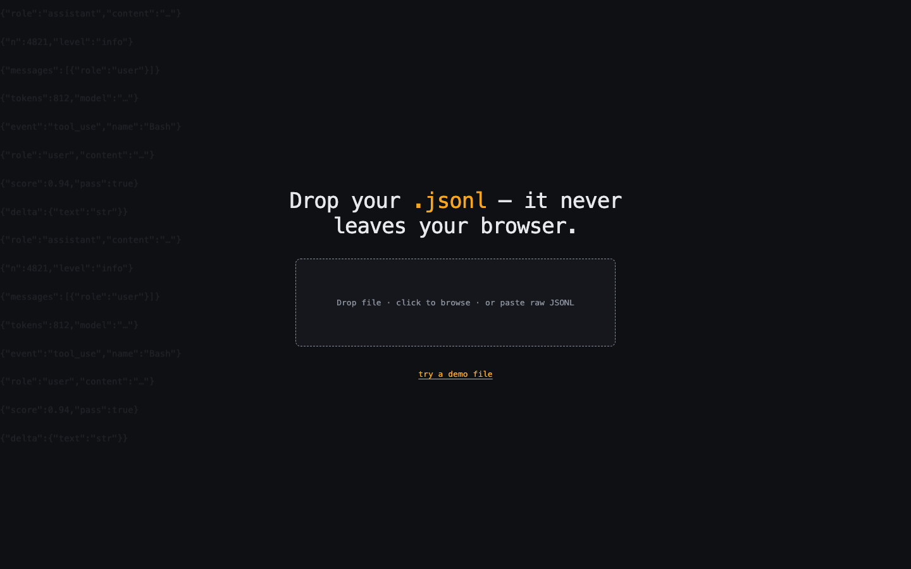
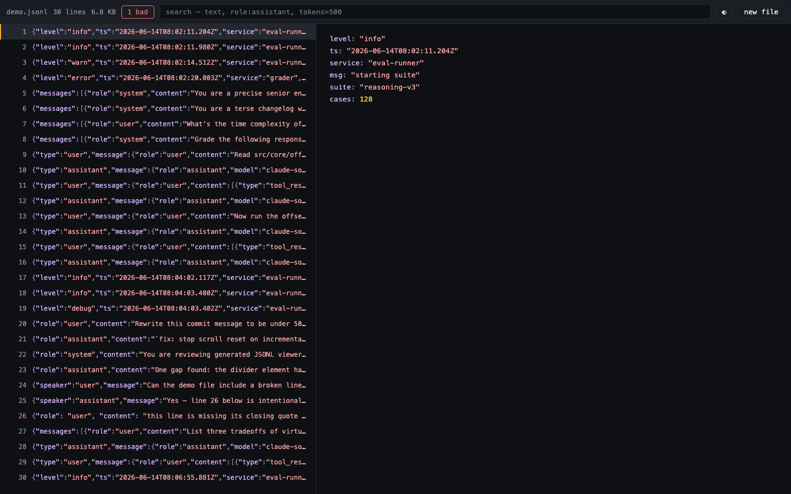
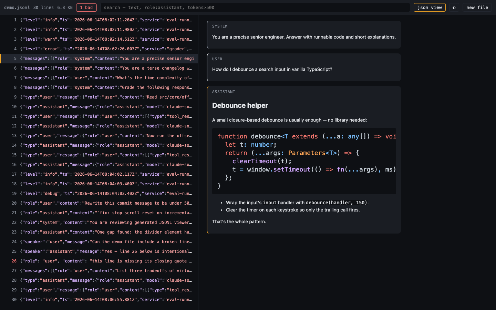
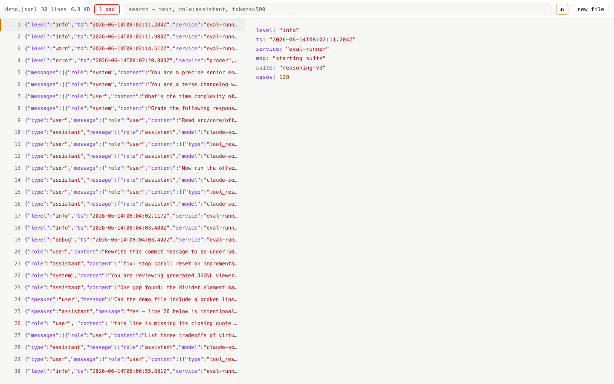

# JSONL Viewer

**View `.jsonl` files instantly, entirely in your browser. Nothing uploads.**

[](https://github.com/viswesh/jsonl-viewer/actions/workflows/ci.yml)
[](LICENSE)
[](docs/ARCHITECTURE.md#bundle-budget)

**[jsonlviewer.com](https://jsonlviewer.com)** — coming soon. Run it locally today (see [Quickstart](#quickstart)).



## Why this exists

JSONL (JSON Lines / NDJSON) is the default format for LLM fine-tune data, eval logs, and agent transcripts. Every "JSON viewer" online chokes on it for the same three reasons:

1. **Paste fails past line 1.** JSONL isn't valid JSON as a whole document — pretty-printer tools error out on the second line.
2. **Files are huge.** Eval logs and fine-tune exports run into hundreds of MB to GB. Browser-paste tools cap out around 5MB.
3. **Files are private.** Logs, transcripts, and training data are not things anyone should upload to a random ad-supported site to view.

JSONL Viewer is a static, framework-free web app that streams the file in a Web Worker, indexes line byte-offsets instead of parsing everything up front, and renders only what's visible. Nothing about the file ever leaves the tab — there's no server, no upload endpoint, and the shipped [Content-Security-Policy](public/_headers) enforces it (open devtools and check).

The other half: most JSONL in the wild *is* an LLM conversation — an OpenAI fine-tune line, an Anthropic message, a Claude Code session entry. JSONL Viewer detects that shape per line and renders it as a readable chat transcript instead of a wall of escaped `\n` characters, with tool calls and thinking blocks collapsed by default.

## Features

- **Streams gigabyte files.** A Web Worker scans the file once for line boundaries and stores byte offsets — it never holds the whole parsed file in memory. Row content is fetched lazily as you scroll.
- **Auto-detected transcript view.** Recognizes OpenAI `{messages:[...]}`, Anthropic message/content-block shapes, and Claude Code session lines — one line at a time, since real files mix formats. See [docs/DETECTION.md](docs/DETECTION.md) for the exact rules, including how to add a new format.
- **Search: text or fields.** Plain text is a live substring filter. Field queries like `role:assistant`, `tokens>500`, or `usage.total_tokens<9` run in the worker with cancellation, so a fast retype never queues stale work.
- **Nothing leaves the browser.** No server, no analytics on file content, no external network calls. `public/_headers` ships a CSP with no external origins — verifiable in your network tab.
- **38KB gzipped**, dependency-free framework, virtualized rendering — the whole app loads faster than most single hero images.

## Screenshots

| JSON mode | Transcript mode |
|---|---|
|  |  |

| Light theme |
|---|
|  |

## Quickstart

```sh
git clone https://github.com/viswesh/jsonl-viewer.git
cd jsonl-viewer
npm ci
npm run dev
```

Open the printed local URL, drop a `.jsonl` file (or click **try a demo file**), and it renders immediately — no build step required for local use, no account, no upload.

## Development

```sh
npm run dev                          # local dev server
npm test                             # unit tests (Vitest)
npm run e2e                          # browser smoke tests (Playwright)
npm run build && npm run check-size  # production build + bundle budget gate (<50KB gz)
```

See [CONTRIBUTING.md](CONTRIBUTING.md) for the full workflow, code style, and PR checklist.

## Architecture

No framework — Vite + vanilla TypeScript. A Web Worker owns file I/O, line indexing, and search; the main thread only renders. See [docs/ARCHITECTURE.md](docs/ARCHITECTURE.md) for the full design: data flow, the virtualized list, the sanitization boundary, and why each dependency (`marked`, `dompurify`, `@speed-highlight/core`) is the only three the project takes.

## Security

File content is treated as fully untrusted input. Every markdown-rendered string passes through DOMPurify before touching the DOM; JSON values render via `textContent`, never `innerHTML`. See [SECURITY.md](SECURITY.md) for the threat model and how to report a vulnerability.

## Contributing

Bug reports, feature requests, and PRs are welcome — see [CONTRIBUTING.md](CONTRIBUTING.md). This project follows the [Contributor Covenant](CODE_OF_CONDUCT.md).

## License

[MIT](LICENSE)
